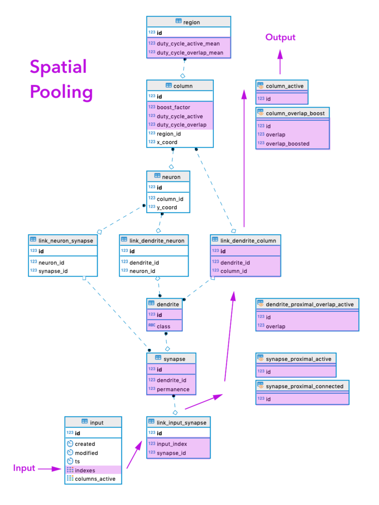

# pgHTM

> **PRIVATE! Not yet for public consumption.**

Machine Intelligence Neurotechnology for streaming prediction and anomaly 
detection.

[Hierarchical Temporal Memory](https://www.numenta.com/machine-intelligence-technology/) 
(HTM) in PostgreSQL. [NuPIC](https://github.com/numenta/nupic) is our base 
reference implementation, but we have varied somewhat.

* [ ] Encoders
* [x] Spatial Pooler
* [ ] Temporal Memory


## Requirements

**Main**

* [PostgreSQL](https://www.postgresql.org/) Backend

**Test**

* [Perl](https://www.perl.org/)
* [pgTAP](https://pgtap.org/) + pg_prove

**Web UI**

* [GraphQL](https://graphql.org/) Midddleware
  * [Docker](https://www.docker.com/)
  * [Hasura](https://hasura.io/)
* Web Frontend
  * [Node.js](https://nodejs.org/)
  * [React](https://reactjs.org/) 
      ([create-react-app](https://facebook.github.io/create-react-app/))


## Setup

### Development @ Mac OS/X

* Expecting: [Homebrew](https://brew.sh/)

#### Main

```bash
brew install postgresql pgcli
pg_ctl -D /usr/local/var/postgres restart
export PGDATABASE=htmdb   # important! psql client & scripts expecting this
createdb

cd src   # your repo checkout parent dir
git clone git@github.com:brev/pghtm.git
cd pghtm/bin
./create.sh
./fill.sh
cd ../..
```

#### Test

* Expecting: Perl (OS/X system default)

**Unit Testing:**

```bash
git clone https://github.com/theory/pgtap.git
cd pgtap
make
make installcheck
make install
psql -c "CREATE EXTENSION pgtap;"
sudo cpan App::cpanminus  # TODO ditch sudo somehow
sudo cpan Test::Pod::Coverage
sudo cpan TAP::Parser::SourceHandler::pgTAP
cd ..

cd pghtm/bin
./test_schema.sh
./test_data_init.sh
cd ../..
```

#### Web UI

```bash
brew cask install docker
brew install node

cd pghtm/webui

## Modify docker-run.sh, set HASURA_GRAPHQL_DATABASE_URL to DB connection info
##  On Mac, like: postgres://USERNAME@host.docker.internal/htmdb
./docker-run.sh
## Open graphql layer in Browser: http://localhost:8080/console
##  Select DATA tab, change Schema to "htm". Use buttons to Add All Tables, 
##  and Track All Relations.

npm install
npm start
## Open web UI layer in Browser: http://localhost:3000/
```


## Usage

* After first use, the initial data tests (above) will no longer pass.
* Try the more modern `pgcli` client instead of stock `psql`.

```bash
psql

INSERT INTO htm.input (indexes) VALUES (ARRAY[0,1,2,3]);
# INSERT 0 1

SELECT indexes, columns_active FROM htm.input;
# indexes   | columns_active
#-----------+----------------
# {0,1,2,3} | {28,31,46,72}
# (1 row)

\q
```


## Schema


## Spatial Pooler



* New **INPUT** row is inserted into `htm.input` table.
  * With new input row, combined with the already-populated view 
    `htm.synapse_proximal_connect`, the view `htm.synapse_proximal_active` 
    auto-updates.
    * With that, view `htm.dendrite_proximal_overlap_active` auto-updates.
      * With that, Column View `htm.column_overlap_boost` auto-updates.
        * Based on that, Column View `htm.column_active` auto-updates. This
          is ready to be the the post-global-inhibition final winner columns.
          However, before that, the following computations (below) will happen,
          and the values here will adapt as boost factors, etc, change below.
  * With new input row, trigger `trigger_input_column_boost_duty_change` fires, 
    running function `htm.column_boost_duty_update()`. Column boost factors 
    and duty cycles are re-calculated and stored in the `htm.column` table.
    Column views will auto-update.
      * With that, all of the following triggers will fire:
        * `trigger_column_input_columns_active_change` will run function
          `htm.input_columns_active_update()`. The active columns set in 
          Column View `htm.column_active`, updated with current boosting, etc,
          values, are now stored back alongside the original new input row in 
          table `htm.input`. This is Spatial Pooler **OUTPUT** complete.
          * As part of the above, trigger `trigger_input_modified_change` 
            runs `htm.schema_modified_update()` before update, timestamping
            when the SP results were added back with the original new input.
            @TODO: This may not be necessary? already in same transaction?
        * `trigger_column_region_duty_cycles_change` will run function
          `htm.region_duty_cycles_update()`. Since table `htm.column` was
          updated, we now re-calculate and store cross-column
          statistics for future computations in table `htm.region`.
        * `trigger_column_synapse_permanence_boost_change` fires and runs
          `htm.synapse_proximal_boost_update()`. Some permanence values
          are boosted in `htm.synapse`.
        * `trigger_column_synapse_permanence_learn_change` fires and runs
          `htm.synapse_proximal_learn_update()`. Learning is perfomed by 
          adjusting synapse permanence values in `htm.synapse`.
* After everything above, especially boosting/learning permanence value 
  changes, the view `htm.synapse_proximal_connect` auto-updates,
  ready for the next cycle of SP computation, and for the next new input.


## Temporal Memory


## Debug

```bash
psql

\timing on
# Timing is on.

UPDATE htm.config SET debug = TRUE;
# UPDATE 1
# Time: 2.184 ms

EXPLAIN ANALYZE VERBOSE INSERT INTO htm.input (indexes) VALUES (ARRAY[0,1,2,3]);
# Lots of Info

LOAD 'auto_explain';
SET auto_explain.log_nested_statements = ON;
SET auto_explain.log_min_duration = 0;
# Run a query, Even more Info

SET auto_explain.log_analyze  = TRUE;
# Run a query, Ludicrous amounts of Info
```


## License

Copyright © 2019 - Brev Patterson, Lux Rota LLC

TODO Private/Unreleased License

This code is an implementation of 
[Hierarchical Temporal Memory](https://en.wikipedia.org/wiki/Hierarchical_temporal_memory), 
on which [Numenta](https://numenta.com) owns patents and intellectual property. 
While this code was written without using any of Numenta’s code, it is likely 
that those patent laws still apply for commerical applications. Before using 
this code commercially, it is reccomended to contact 
[Lux Rota](https://luxrota.com) and [Numenta](https://numenta.com).

