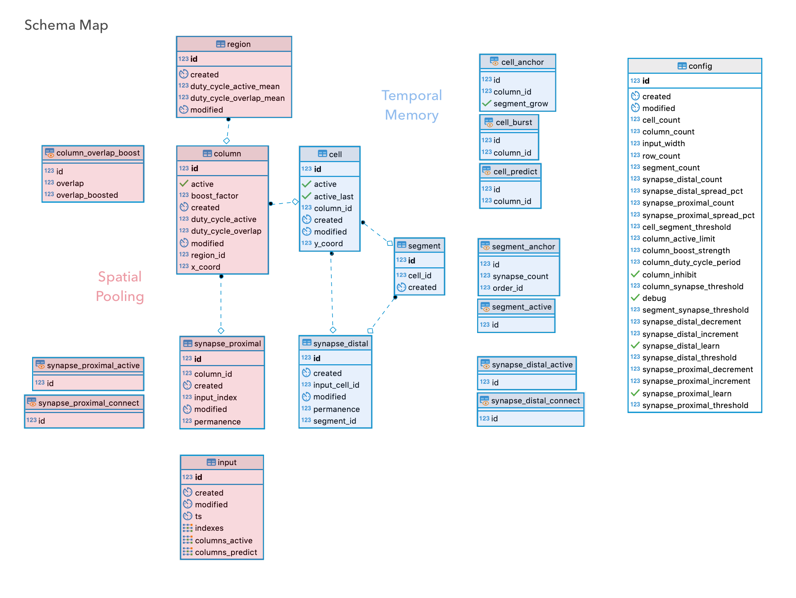

# pgHTM

> **PRIVATE! Internal use only. Not yet for public release.**

[Hierarchical Temporal Memory](https://www.numenta.com/machine-intelligence-technology/) 
(HTM) in PostgreSQL. 

Machine Intelligence Neurotechnology for streaming prediction and anomaly 
detection. 

[NuPIC](https://github.com/numenta/nupic) is our base reference implementation, 
but we have varied somewhat.

**Progress:**

* [ ] Encoders
* [X] Spatial Pooler
* [X] Temporal Memory
* [ ] Anomaly Prediction


## Setup

### Requirements

Layer      | Technology
-----------|-----------
Backend    | [PostgreSQL](https://www.postgresql.org/)
Test       | [Perl](https://www.perl.org/), [pgTAP](https://pgtap.org/)
Middleware | [Docker](https://www.docker.com/), [Hasura](https://hasura.io/) GraphQL
Frontend   | [Node.js](https://nodejs.org/), [React](https://facebook.github.io/create-react-app/)

### Development @ Mac OS/X

* Expecting: [Homebrew](https://brew.sh/)

#### Backend

```bash
brew install postgresql pgcli
pg_ctl -D /usr/local/var/postgres restart
export PGDATABASE=htmdb   # important! psql client & scripts expecting this
createdb

cd src   # your repo checkout parent dir
git clone git@github.com:brev/pghtm.git
cd pghtm/bin
./create.sh
./fill.sh
cd ../..
```

#### Test

* Expecting: Perl (OS/X system default)

**Unit Testing:**

```bash
git clone https://github.com/theory/pgtap.git
cd pgtap
make
make installcheck
make install
psql -c "CREATE EXTENSION pgtap;"
sudo cpan App::cpanminus  # TODO ditch sudo somehow
sudo cpan Test::Pod::Coverage
sudo cpan TAP::Parser::SourceHandler::pgTAP
cd ..

cd pghtm/bin
./test_schema.sh
./test_data_init.sh
cd ../..
```

#### Middleware

```bash
brew cask install docker

cd pghtm/webui

## Modify docker-run.sh, set HASURA_GRAPHQL_DATABASE_URL to DB connection info
##  On Mac, like: postgres://USERNAME@host.docker.internal/htmdb
./docker-run.sh
## Open graphql layer in Browser: http://localhost:8080/console
##  Select DATA tab, change Schema to "htm". Use buttons to Add All Tables, 
##  and Track All Relations.

cd ../..
```

#### Frontend

```bash
brew install node

cd pghtm/webui

npm install
npm start
## Open web UI layer in Browser: http://localhost:3000/
```


## Usage

* After first use, the initial data tests (above) will no longer pass.
* Hint: Try the more modern `pgcli` client instead of stock `psql`.

```bash
psql

-- example 3-step sequence
INSERT INTO htm.input (indexes) VALUES (ARRAY[0,1,2,3]);
INSERT INTO htm.input (indexes) VALUES (ARRAY[10,11,12,13]);
INSERT INTO htm.input (indexes) VALUES (ARRAY[20,21,22,23]);
INSERT INTO htm.input (indexes) VALUES (ARRAY[0,1,2,3]);

-- basic output: SDR and prediction
SELECT * FROM htm.input ORDER BY id DESC LIMIT 1;
# indexes   | columns_active | columns_predict
#-----------+----------------+----------------
# {0,1,2,3} | {28,31,46,72}  | {11,21,95,97}

-- advanced output: union of active+predict to send up hierarchy
SELECT (columns_active || columns_predict) FROM htm.input;
# {11,21,28,31,46,72,95,97}

\q
```


## Schema Map




## Spatial Pooler

1. **INPUT**. New input row is inserted.

    INSERT | `input.indexes`
    -------|----------------

    1. **VIEWS**. New input row is combined with connected synapses to 
        auto-compute active synapses.

        VIEW   | `synapse_proximal_active`
        -------|--------------------------
        Source | `input.indexes`
        Source | `synapse_proximal_connect`
      
        1. Active synapses cause auto-update of active segments and overlap
            scores.

            VIEW   | `segment_proximal_overlap_active`
            -------|-----------------------------------
            Source | `synapse_proximal_active`

            1. Active segments cause auto-update of possibly active columns 
                and their overlaps. This is a pre-boosting, 
                pre-global-inhibition list of possible winner columns. Before 
                inhibition and winner column selection, the next section of 
                computations (below) will execute, and the values in this view 
                will adapt accordingly.

                VIEW   | `column_overlap_boost`
                -------|-----------------------------------
                Source | `segment_proximal_overlap_active`

    1. **TRIGGERS**. Column boost factors and duty cycles are re-calculated 
        and stored for new input. Column and related views (previous section 
        above) will auto-update dynamically in step.
      
        TRIGGER  | `trigger_input_column_boost_duty_change`
        ---------|-----------------------------------------
        Source   | `input.indexes`
        Function | `column_boost_duty_update()`
        Target   | `column.(boost_factor, duty_cycle_active/overlap)`
      
        1. Perform global inhibition to select final winner columns, and flag. 
            
            TRIGGER  | `trigger_column_active_change`
            ---------|--------------------------
            Source   | `column.(boost_factor, duty_cycle_active/overlap)`
            Function | `column_active_update()`
            Target   | `column.active`
        
            1. **OUTPUT**. Active columns are are now stored back alongside 
                the original new input row. Spatial Pooler compute cycle is
                basically complete, besides next-timestep prep (the rest of
                this section). These active columns are the input to the 
                Temporal Memory (next section below).

                TRIGGER  | `trigger_column_input_columns_active_change` 
                ---------|---------------------------------------------
                Source   | `column.active`
                Function | `input_columns_active_update()`
                Target   | `input.columns_active`

            1. Synaptic Learning is performed on winning columns by 
                adjusting proximal synapse permanence values.
            
                TRIGGER  | `trigger_column_synapse_proximal_permanence_learn_change`
                ---------|-------------------------------------------------
                Source   | `column.active`
                Function | `synapse_proximal_learn_update()`
                Target   | `synapse.permanence`

        1. Synaptic Boosting is performed by adjusting some synapse 
            permanence values.
        
            TRIGGER  | `trigger_column_synapse_permanence_boost_change`
            ---------|-------------------------------------------------
            Source   | `column.(boost_factor, duty_cycle_active/overlap)`
            Function | `synapse_proximal_boost_update()`
            Target   | `synapse.permanence`
                  
        1. Re-calculate and store region-wide cross-column statistics for 
            future computations.
            
            TRIGGER  | `trigger_column_region_duty_cycles_change`             
            ---------|-------------------------------------------
            Source   | `column.(boost_factor, duty_cycle_active/overlap)`
            Function | `region_duty_cycles_update()`
            Target   | `region.(duty cycles)`
            
    1. **VIEW** After everything above is complete (boosting/learning/etc),
        the original list of connected synapses auto-updates. Connected
        synapses are now ready for the next new input, and the cycle starts
        over from top.

        VIEW   | `synapse_proximal_connect`        
        -------|---------------------------
        Source | `synapse.permanence`


## Temporal Memory

1. **INPUT**. Active columns are provided by a finsihed Spatial Pooler.
    
    UPDATE | `input.columns_active`
    -------|-----------------------

    1. **VIEWS**.

        VIEW   | `synapse_distal_active`
        -------|--------------------------
        Source | `input.columns_active`
        Source | `synapse_distal_connect`
        
        VIEW | `cell_anchor`
        
        **TODO**

    1. **TRIGGERS**. With newly active columns, but before we change
        cell activity states (and thus predicted cells), we need to
        punish predicted cells that were predicted but did not become
        active. This is accomplished through synaptic permenance
        decrements.
        
        TRIGGER  | `trigger_input_a_synapse_nonpredict_punish_change`
        ---------|--------------------------------
        Source   | `input.columns_active`
        Function | `synapse_nonpredict_punish_update()`
        Target   | `synapse.permanence`
        
    1. Newly active columns means we can now compute newly 
        active cells. Decide between distally-activated predicted cells 
        or proximally-activated bursting column-cells. Predictions
        will automatically update afterword.
                    
        TRIGGER  | `trigger_input_cell_active_change`
        ---------|--------------------------------
        Source   | `input.columns_active`
        Function | `cell_active_update()`
        Target   | `cell.active`

        1. Cells that are being activated have their previous active
            state saved in active_last field.

            TRIGGER  | `trigger_cell_active_last_change`
            ---------|--------------------------------
            Source   | `cell.active`
            Function | `cell_active_last_update()`
            Target   | `cell.active_last`

        1. **OUTPUT**. Newly activated cells cause next-step predicted 
            cell views to update. These newly Predicted cell/columns are 
            now stored back alongside their original parent new input 
            row, and SP active columns. Temporal Memory compute cycle
            is complete, except for next-timestep prep (rest of 
            this section).
            
            TRIGGER  | `trigger_cell_input_columns_predict_change`
            ---------|---------------------------------------------
            Source   | `cell.active`
            Function | `input_columns_predict_update()`
            Target   | `input.columns_predict`

        1. Perform distal synaptic learning on learning anchor cells which 
            already have existing segments/synapses connections.
        
            TRIGGER  | `trigger_cell_anchor_synapse_learn_change`
            ---------|-------------------------------------------------
            Source   | `cell.active`
            Function | `synapse_distal_anchor_learn_update()`
            Target   | `synapse.permanence`

        1. Grow new segments/synapses on learning anchor cells which did
            not have them before. Connections will be made to cells
            active on the pevious timestep, and will be learned on 
            next time.

            TRIGGER  | `trigger_cell_anchor_synapse_segment_grow_change`
            ---------|---------------------------------------------
            Source   | `cell.active`
            Function | `cell_anchor_synapse_segment_grow_update()`
            Targets  | `segment`, `synapse`


## Debug

```bash
psql

\timing on
# Timing is on.

SET log_duration TO TRUE;
# 2019-01-28 00:01:34.109 PST [64827] LOG:  duration: 0.147 ms

UPDATE htm.config SET debug = TRUE;
# Our debug logging now on

EXPLAIN ANALYZE VERBOSE INSERT INTO htm.input (indexes) VALUES (ARRAY[0,1,2]);
# Run a query, explain a bit

SET debug_print_parse TO TRUE;
# Run a query, lots of query details

LOAD 'auto_explain';
SET auto_explain.log_nested_statements = ON;
SET auto_explain.log_min_duration = 0;
# Run a query, Even more Info

SET auto_explain.log_analyze  = TRUE;
# Run a query, Ludicrous amounts of Info
```


## Legal

> **PRIVATE! Internal use only. Not yet for public release.**

### Copyright

Copyright © 2018-2019 · Brev Patterson · Lux Rota LLC
 
> Other owners retain copyright to their respective works.

### Dual License

Purpose                  | License
-------------------------|-------- 
Non-Commercial, Internal | [AGPLv3](https://www.gnu.org/licenses/agpl-3.0.en.html)
Commercial               | [Numenta](https://numenta.com/)

#### AGPLv3

```
This program is free software: you can redistribute it and/or modify
it under the terms of the GNU Affero General Public License as
published by the Free Software Foundation, either version 3 of the
License, or (at your option) any later version.

This program is distributed in the hope that it will be useful,
but WITHOUT ANY WARRANTY; without even the implied warranty of
MERCHANTABILITY or FITNESS FOR A PARTICULAR PURPOSE.  See the
GNU Affero General Public License for more details.

You should have received a copy of the GNU Affero General Public License
along with this program.  If not, see <https://www.gnu.org/licenses/>.
```

#### Numenta

This code is an implementation of 
[Hierarchical Temporal Memory](https://en.wikipedia.org/wiki/Hierarchical_temporal_memory), 
on which [Numenta](https://numenta.com) owns patents and intellectual property. 
While this code was written without using any of Numenta’s code, it is likely 
that those patent laws still apply for commerical applications. Before using 
this code commercially, it is reccomended to contact 
[Numenta](https://numenta.com).

